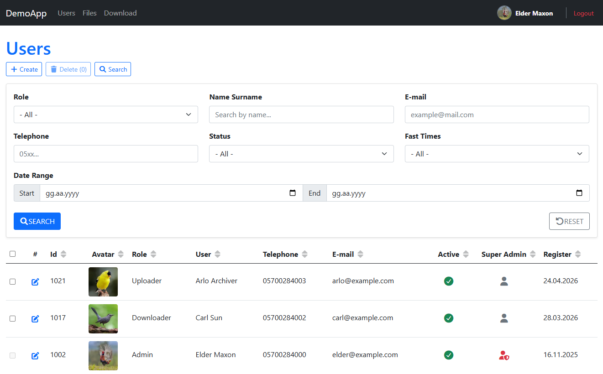
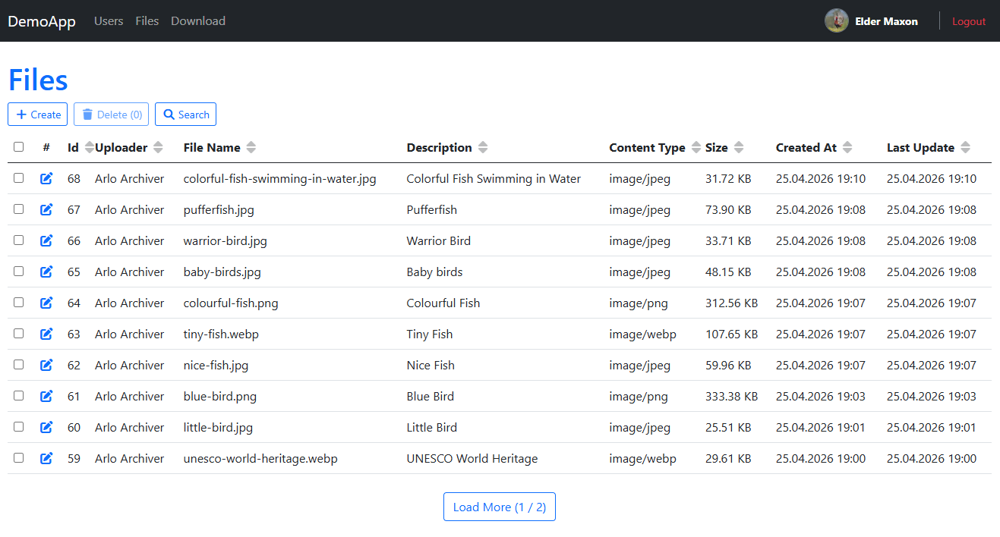
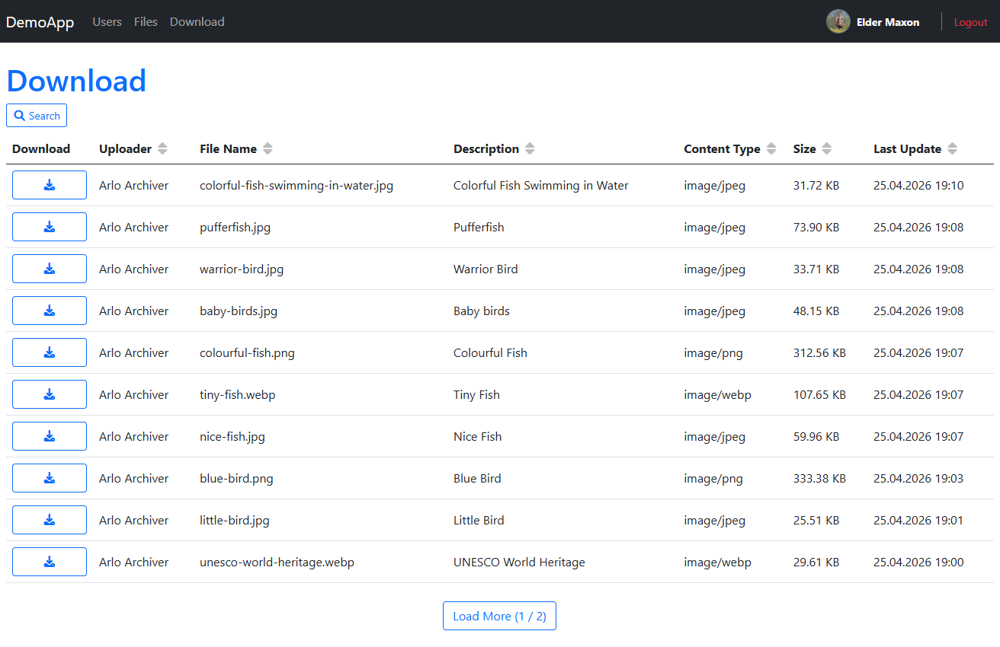

# 🚀 AspNetCoreMvcDemoApp

This repository is a **comprehensive showcase** of the [SadLib](https://github.com/ElderMaxonNET/SadLib) library integrated into a robust **ASP.NET Core 10 MVC** architecture. It demonstrates professional software engineering patterns, clean code principles, and efficient infrastructure management.

## 📸 Screenshots & Showcase

The following screenshots demonstrate the core functionalities of the **AspNetCoreMvcDemoApp**, powered by the **SadLib** infrastructure framework.

### 1. User Management (RBAC & Advanced Image Processing)
A functional administration panel featuring role-based access control and automated profile image optimization.

* **Automated Image Pipeline:** User avatars are automatically converted to **.webp** format and saved in **3 different dimensions** for optimized delivery.
* **Granular RBAC:** Comprehensive permission management for Admins, Uploaders, and Downloaders.
* **Advanced Filtering:** Multi-criteria search by role, status, date range, and contact info.

### 2. File Operations & Multi-Upload
This section demonstrates raw file handling and robust storage management via **SadLib** abstractions.

* **Bulk Upload & Custom Naming:** Support for **multi-file uploads** with the ability to assign custom filenames during the process.
* **Flexible Extensions:** Managed storage and secure handling for various system-allowed raw file types.
* **Integrated Search:** Efficiently locate stored assets using built-in search filters within the management console.

### 3. Media Download Center
A streamlined, high-performance interface for public or authenticated asset retrieval.

* **Custom Security Middleware:** All file requests are intercepted by `FileSecurityMiddleware`, preventing unauthorized access even if the direct file URL is known.
* **Search & Discovery:** Quickly find specific assets using the integrated search functionality.
* **Optimized UX:** Implementing "Load More" pagination and secure download links for all infrastructure-stored files.

## 🌟 Key Architectural Features

This demo isn't just a simple web app; it's a battle-tested infrastructure template:

* **Role-Based Access Control (RBAC):** Secure navigation and action management for `Admin`, `Uploader`, and `Downloader` roles.
* **Infrastructure Layer:** Custom implementations for:
    * **Image Processing:** Efficient graphics handling and manipulation.
    * **Memory Caching:** In-memory caching strategies to boost performance.
    * **Background Workers:** Specialized workers for application initialization and tasks.
* **Data Persistence:** A clean **Repository Pattern** implementation powered by **Dapper**, featuring custom type handlers (like `DateOnly`) and mapping extensions.
* **Advanced Web Components:** * **TagHelpers:** Custom `Vue-like` TagHelpers for dynamic and reusable UI components.
    * **Global Exception Handling:** Centralized error management with custom filters and handlers.
    * **Security Middleware:** Custom file security and authentication flows.

## 🛠 Tech Stack

* **Runtime:** .NET 10 (latest)
* **Framework:** ASP.NET Core MVC
* **ORM / Data:** Dapper with SQL Server
* **Library Support:** [SadLib](https://github.com/ElderMaxonNET/SadLib) (Core Logic & Extensions)
* **Design:** Repository Pattern, Unit of Work (DataService), Dependency Injection Extensions.

### Key Integration Points:

* **Contract-Based Mapping:** Automatically discovers and maps Entities to DTOs within the specified namespace, eliminating the need for manual and repetitive `AutoMapper` configurations.
* **Managed Storage & Upload:** Utilizes the `PhysicalStorageProvider` to handle all file system operations and secure file uploads through high-level SadLib abstractions.
* **Managed Database Operations:** Seamlessly integrates **Dapper** with a managed `IDbClient`, providing robust SQL Server connectivity, transaction support, and efficient execution.
* **Advanced Security:** Leverages built-in `Security` extensions for industrial-grade **SHA512** password hashing and cryptographic salt verification.
* **Fluent Extensions:** Extensive application of SadLib's specialized string, date, and generic collection extensions to keep the business logic lean, readable, and maintainable.

## 🐳 Getting Started

The project now includes a **fully automated database setup** script using Docker. No manual SQL execution or SSMS configuration is required.

### 1. Prerequisites
*   [Docker Desktop](https://www.docker.com/products/docker-desktop/) installed and running.
*   [.NET 10 SDK](https://dotnet.microsoft.com/download/dotnet/10.0) installed.
*   A terminal (Bash, WSL2, or Git Bash for Windows).

### 2. Environment Setup
1.  Open the project folder in your IDE (e.g., Visual Studio or VS Code).
2.  Open a **Terminal** and ensure you are using a **Bash-compatible shell** (On Windows, use **WSL/Ubuntu** or **Git Bash**).
3.  **Grant Execution Permissions:**
    ```bash
    chmod +x setup.sh
    ```
4.  **Run the Setup Script:**
    ```bash
    ./setup.sh
    ```
    *This script will: Start a SQL Server 2025 container, wait for health checks, and automatically restore the production-ready database backup.*

### 3. Configure User Secrets
These credentials match the default administrator created during the database restoration:
```bash
dotnet user-secrets set "DefaultLogin:Email" "elder@example.com"
dotnet user-secrets set "DefaultLogin:Password" "123456"
dotnet user-secrets set "ConnectionStrings:DefaultConnection" "Server=host.docker.internal;Database=AspNetCoreMvcDemoAppDb;User Id=sa;Password=Sener_Dev_2026!;TrustServerCertificate=True"
```

## 🚀 Running the Application

Once the database is ready and secrets are configured:  
**Visual Studio:** Press F5 or click the Start button.  
**CLI:** Execute the following command in your terminal:
```bash
dotnet run
```